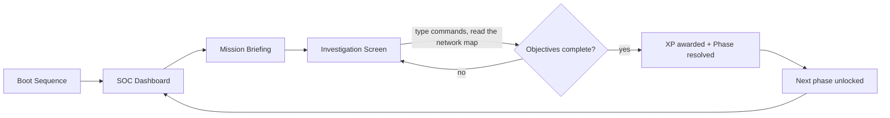

# 🛡️ Protocol: Breach

**A browser-based cybersecurity simulation game where players learn real security concepts by doing — not by reading.**

[](https://react.dev)
[](https://vitejs.dev)
[](https://github.com/pmndrs/zustand)
[](https://www.framer.com/motion/)
[]()

---

## 📖 Overview

**Protocol: Breach** puts the player in the shoes of a newly hired **junior security analyst** at *Helix Corporation*, a company under active cyberattack. Working from a simulated **SOC (Security Operations Center)**, the player investigates real incidents — a downed server, unauthorized network traffic, a compromised port — using an interactive network map and a real command-line terminal.

The game is built around one core design principle: **the tool is taught, not the answer.** A built-in reference manual (the *Codex*) explains what each command does and why it exists — but never which command solves which incident, in what order, or with what parameter. Players have to reason through the scenario the same way a real analyst would.

This project was built to demonstrate that security concepts (networking, ports, DNS-style diagnostics, firewalls, incident response) can be taught through genuine problem-solving instead of multiple-choice quizzes.

---

## ✨ Features

- **Boot sequence** — an animated system-initialization screen that sets the tone before the player ever touches the keyboard.
- **SOC Dashboard** — a 3-column command center: unlockable departments, a live incident/alert feed, an interactive SVG network topology, and a monitor-mode terminal.
- **Reactive network map** — nodes pulse and change color (online / degraded / offline) as the incident evolves, with an animated traffic path visualizing the live threat.
- **Mission briefings** — every phase opens with a scenario briefing: the incident, the objectives, and the concepts the player will pick up along the way.
- **A real terminal, not a quiz** — commands are typed from scratch. There are no pre-filled buttons handing over the correct answer; the player has to know (or look up) the right tool and the right parameter.
- **The Codex** — an in-game manual documenting every available command (syntax, purpose, category) without ever revealing which one resolves the current objective.
- **XP & leveling** — objectives and phases award experience, tracked in a persistent player profile.
- **Built to grow** — departments, phases, objectives, and commands are all defined in a handful of data files. Adding a new investigation doesn't require touching the game engine.

---

## 🕹️ Gameplay Loop



---

## 🧰 Tech Stack

| Layer            | Choice                                         |
|-------------------|-------------------------------------------------|
| UI                | React 19 + Vite                                 |
| State management  | Zustand (persisted to `localStorage`)           |
| Animation         | Framer Motion                                   |
| Styling           | CSS Modules, custom cyberpunk design system     |
| Linting           | oxlint                                          |

---

## 🚀 Getting Started

**Prerequisites:** Node.js 18+ and npm.

```bash
# Clone the repository
git clone https://github.com/dunif2/Protocol_Breach_V1.git
cd Protocol_Breach_V1

# Install dependencies
npm install

# Run the dev server
npm run dev
```

Other available scripts:

```bash
npm run build     # production build
npm run preview   # preview the production build locally
npm run lint      # run oxlint
```

---

## 🗂️ Project Structure

```
src/
├── screens/          # Top-level screens (Boot, SOC Dashboard, Gameplay, Codex, Mission Modal)
├── components/        # Reusable UI (Terminal, NetworkMap, ObjectiveTracker, AlertPanel, ...)
├── data/               # Game content: departments, missions, network nodes, commands
├── store/             # Zustand store — XP, progress, node states, live alerts
├── hooks/             # useTerminal (command execution), useProgress (objectives → XP → unlocks)
└── App.jsx            # Screen router
```

Every phase is defined once, in data, as a self-contained object: its briefing, its objectives, and the commands it exposes. The terminal engine and the Codex are both driven entirely by that data — adding **Phase 3** means writing a new phase object, not rewiring the game.

---

## 🗺️ Roadmap

- [x] Department: **Networks** — *Network Failure* & *Unknown Traffic*
- [ ] Department: **Endpoint Security**
- [ ] Department: **Cryptography**
- [ ] Department: **Digital Forensics**
- [ ] Persistent backend / cloud save
- [ ] Sound design (ambient SOC noise, keystroke feedback, alert chimes)

---

## 👤 Author

Built by **[Ricardo](https://github.com/dunif2)**.

---

<p align="center"><sub>Protocol: Breach is an educational simulation. Helix Corporation, its network, and all incidents depicted are fictional.</sub></p>
