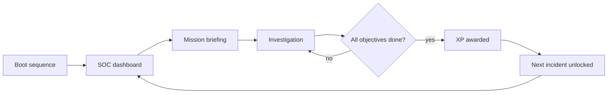

# Protocol: Breach

A cybersecurity simulation game that runs in the browser. You play a junior analyst at a company that is already under attack.

[](https://react.dev)
[](https://vitejs.dev)
[](https://github.com/pmndrs/zustand)
[](https://www.framer.com/motion/)

## What it is

You start your first day at Helix Corporation's security operations center, and the finance server is already down. Nobody has time to walk you through it. You get a live network map, a terminal, and a few objectives.

Most security training either lectures you or quizzes you. I wanted something closer to the real job, where you look at a broken system, form a theory, type a command and see what happens.

That led to the one rule the whole game is built around. The in-game manual, called the Codex, explains what every command does and why it exists. It never tells you which command solves the current problem, in what order to run them, or what to point them at. You work that out from the incident, the objectives and whatever the terminal prints back.

This is version 1. It's early, and it's playable from start to finish.

## What you can play today

The game opens on a boot sequence, then drops you into the SOC dashboard: a department list, a live alert feed, an SVG map of the company network and a monitor terminal. Pick an incident and you get a briefing with the objectives and the concepts you'll run into.

Then you investigate. Nodes on the map pulse and change color as things get fixed or get worse. Commands are typed by hand, with no suggested buttons to click. If you forget what `tracert` does, the Codex is one click away in the top corner.

Two incidents are in so far, both under the Networks department:

1. **Network Failure.** A server is offline and nobody knows why.
2. **Unknown Traffic.** Packets from an unfamiliar address keep hitting the network. Work out what they want and shut it down.

Finishing objectives earns XP, which feeds a persistent level. Progress is saved in the browser.

## Game flow



## Tech stack

| Layer | Choice |
|-------|--------|
| UI | React 19 and Vite |
| State | Zustand, persisted to `localStorage` |
| Animation | Framer Motion for screen and modal transitions, CSS keyframes for the ambient effects |
| Styling | CSS Modules |
| Linting | oxlint |

## Running it locally

You need Node.js 18 or newer.

```bash
git clone https://github.com/dunif2/Protocol_Breach_V1.git
cd Protocol_Breach_V1
npm install
npm run dev
```

The other scripts are `npm run build`, `npm run preview` and `npm run lint`.

## How the code is organized

```
src/
├── screens/      Boot, SOC dashboard, investigation, Codex, mission modal
├── components/   Terminal, network map, objective tracker, alert feed
├── data/         Departments, missions, network nodes, commands
├── store/        Zustand store: XP, progress, node states, alerts
└── hooks/        Command execution and objective-to-XP logic
```

Everything the game says and does lives in `src/data`. An incident is one object with its briefing, objectives and commands, and both the terminal and the Codex read from it. Adding a third incident means writing that object. The engine doesn't change.

## Roadmap

- [x] Networks department (two incidents)
- [ ] Endpoint Security
- [ ] Cryptography
- [ ] Digital Forensics
- [ ] Cloud save
- [ ] Sound: keystrokes, alerts, the hum of a server room

## Author

Made by [Ricardo](https://github.com/dunif2). Feedback and ideas are welcome, especially from people who work in security and can tell me what I got wrong.

Helix Corporation and every incident in the game are fictional.
